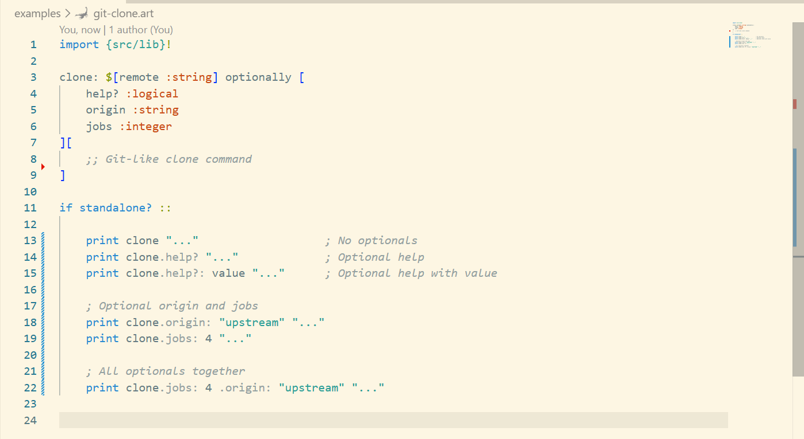

<h1 align="center">optionally</h1>

<p align="center">
    <i>Supercharged typed optionals interface support for Arturo Programming Language</i>
    <br><br><br>
    
    
    <br>
    <b>~ CODE IS ART ~</b>
    <br><br>
</p>

<p align="center">
    <a href="https://www.arturo-lang.org"></a>
    &nbsp;
    <a href="https://github.com/RickBarretto/optionally/blob/main/LICENSE"></a>
    &nbsp;
    <a href="https://github.com/RickBarretto/optionally/actions"></a>
</p>

## At a Glance

<p align="center">
    
</p>

## Installation

```sh
arturo -p install optionally
```

or

```art
import {optionally}!
```

## Documentation

